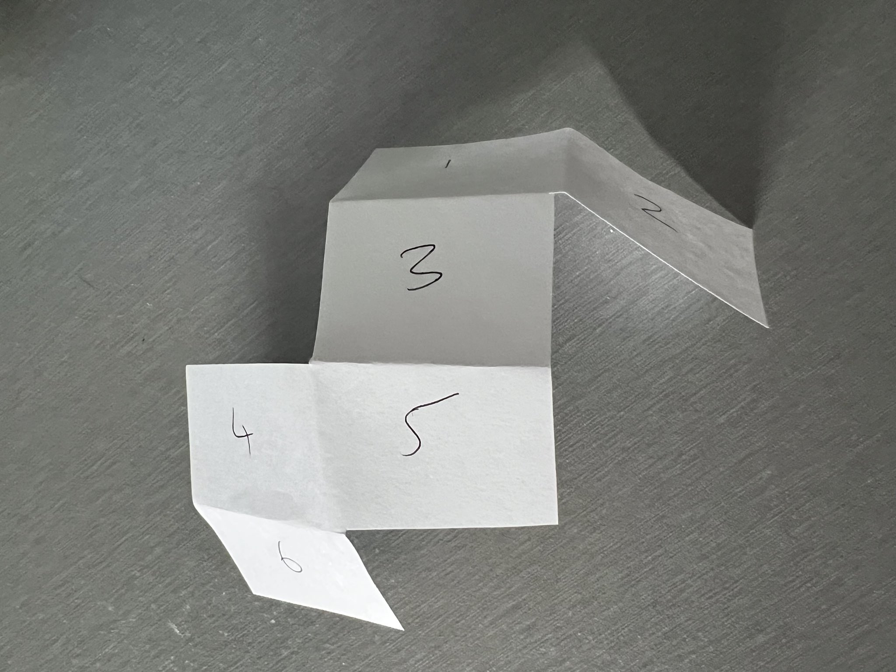
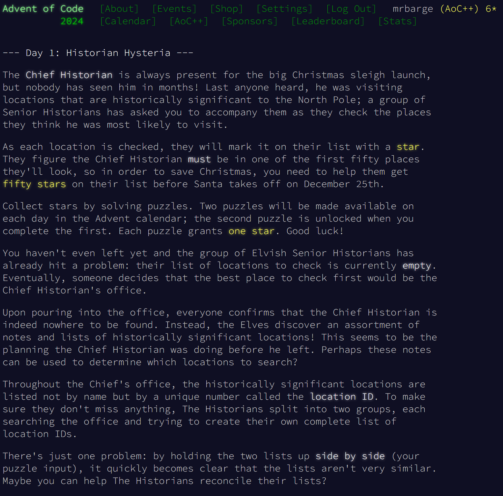
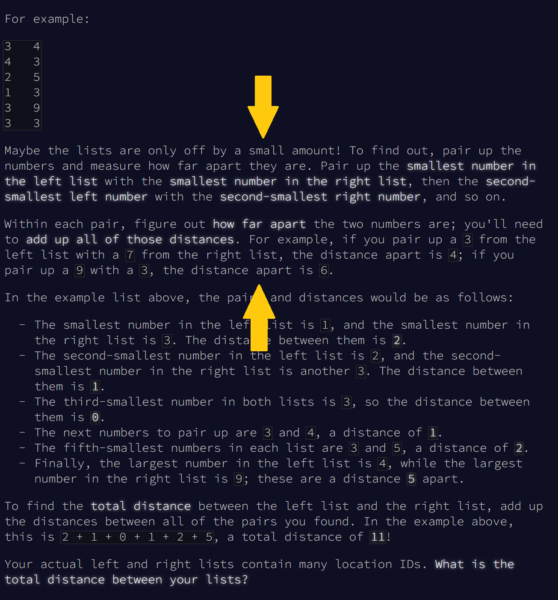
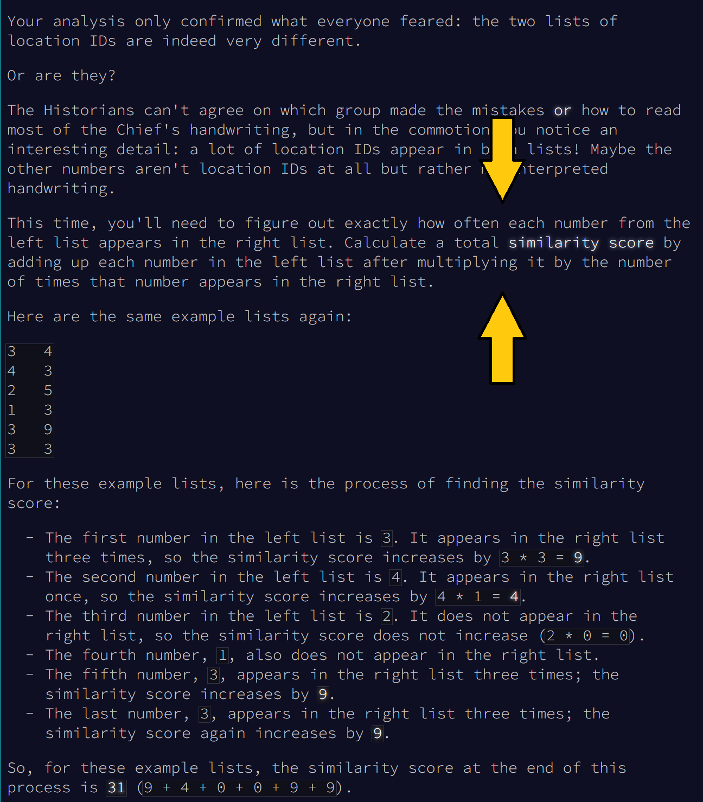
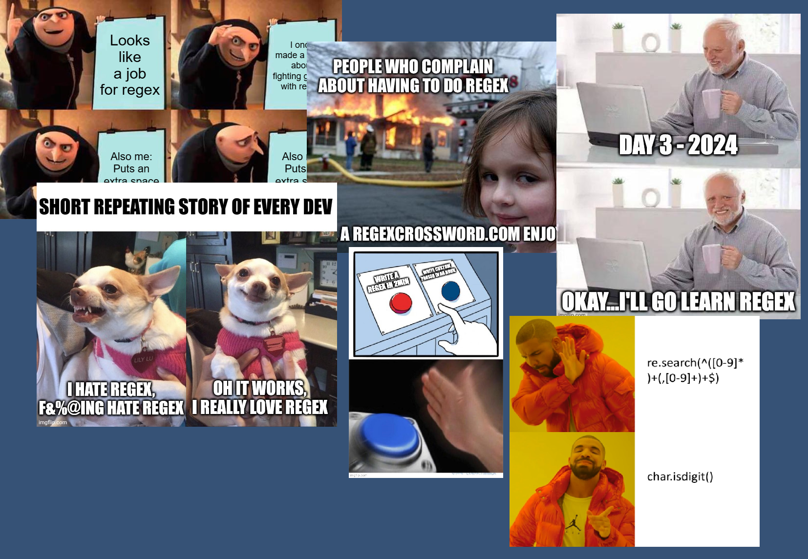
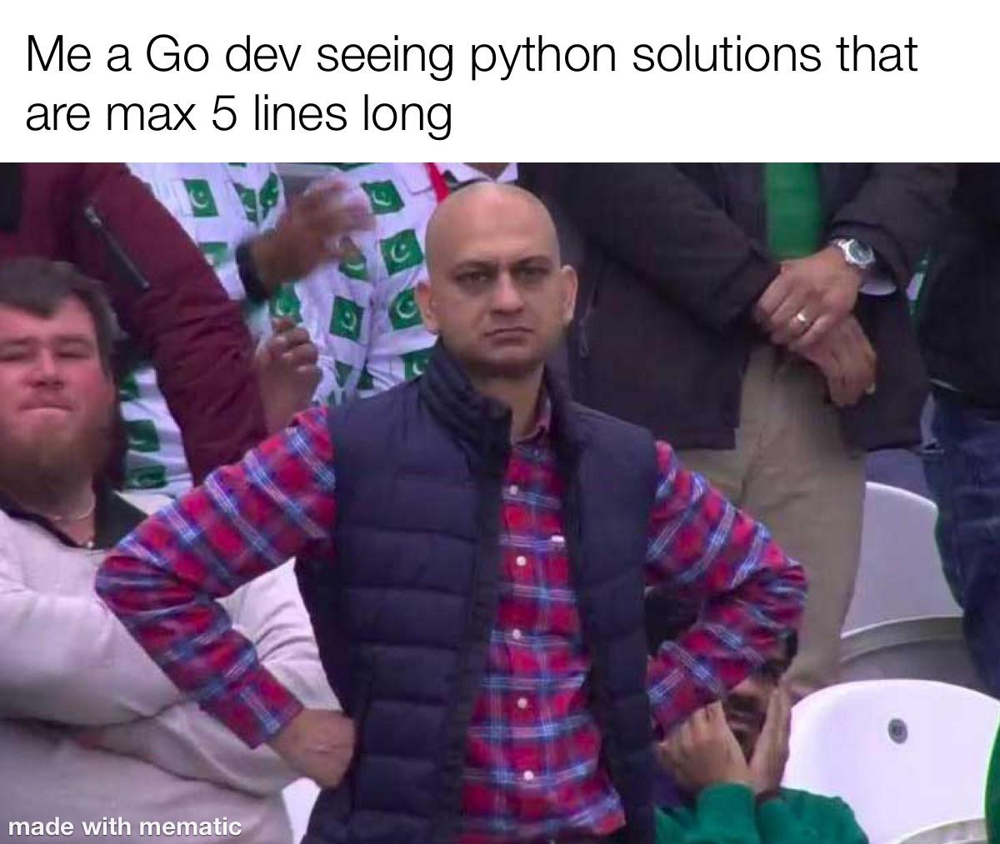

<section data-markdown="example.md" data-separator="^\n\n\n"
         data-separator-vertical="^\n\n" data-separator-notes="^Note:">

# 'Tis the to be season to be <span style="color: #ff6347;">python-ey</span>

with Advent of Code


## About me 👋

<span style="color: #ff6347;">Matt Bargenquast</span>

🐍 Python is my go-to <span style="color: #ff6347;">"just get it done"</span> tool.

🐕 I ❤️ greyhounds. 


## What're we here for today? 🐍

My goal is to convince at least <span style="color:gold">_one_</span> of you to go and
try Advent of Code.


## What's <span style="color:gold">Advent of Code</span>?

www.adventofcode.com

* Yearly event of programming puzzles by <span style="color:gold">Eric Wastl</span>. 
* Advent calendar style approach (a puzzle per day).
* Runs from December 1 to December 25.


## Does that mean I'm already too late?

### <span style="color:gold">No!*</span>
###### (* unless you're looking to win a leaderboard)

Puzzles can be solved at any time throughout the year.


## What do you mean by <span style="color:gold">puzzles</span>?

* Each day has <span style="color:gold">two</span> individually-solvable parts.
* Almost always:
  * Parsing some form of input data.
  * Figuring something out based on that input.
  * Coming up with a single answer (usually a number)


## So, what's so <span style="color:gold">good</span> about it?


## There's no <span style="color:red">"wrong"</span> way to do it

* Implement it..
  - ..<span style="color:gold">however</span> you want
  - ..with <span style="color:gold">whatever</span> you want
* Just get the right answer and earn that ⭐⭐ 


## No, really..



(me solving 2022 Day 22 Part 2)


## The <span style="color:gold">community's</span> awesome
#### (and frequently bonkers)

.. we'll get to that later ..


## The <span style="color:red">"dreaded"</span> part two.. 💀

* A twist on part one.
* Can be a good test of how nicely you solved part one.
* Or alternatively..
 
<div style="text-align: center;">
  
</div>


## It's great for learning

* Covers a lot of programming fundamentals
  * 💾 I/O
  * 🍝 Structuring code
  * 🚄 Optimization
  * 🏠 Data structures
  * 😭 Debugging (a lot)
* (Rarely) scary computer sciencey stuff
* (Rarely, if ever) scary mathematical stuff


## I guarantee one thing..

You <span style="color:gold">**WILL**</span> become intimately

acquainted with <span style="color:gold">step debuggers</span>. 


## Let's walk through a problem

<div style="text-align: center;">
  
</div>


## The important bit

<div style="text-align: center;">
  
</div>


## Start with the basics

```python [5-6|7-8|9-12|1-3]
def part_one(left: list[int], right: list[int]) -> int:
    # We'll implement this last
    return 0

if __name__ == '__main__':
    with open('test.txt', 'r') as f:
        # read our test data in
        left, right = read_data(f.readlines())

        # find part one answer
        answer = part_one(left, right)
        print(f"Part one: {answer}")
```


## Read our input data

```
3   4
4   3
2   5
1   3
3   9
...
```

```python
def read_data(lines: list[str]) -> (list[int], list[int]):
    """
    Reads the problem input data into a tuple of sorted columns.
    :param lines: input data
    :return: tuple containing sorted numeric list rep of each column
    """
    left, right = [], []
    for line in lines:
        lval, rval = map(int, line.split())
        left.append(lval)
        right.append(rval)
    left.sort()
    right.sort()
    return left, right
```


## Tip: Break things up into purposeful functions

* Think of it like baking a lasagna 👩🏽‍🍳
* Avoid long functions doing too many things.
* Helps you <span style="color: #ff6347;">_test_</span>! (segue incoming..)


## Tip 2: Write test cases to verify those functions

* Helps you build your code with confidence.
* Once you know that function is working right, you'll never have to worry about it again (*maybe)


## Let's write a simple test case!

```python
@pytest.fixture
def test_data():
    with open('test.txt', 'r') as f:
        return f.readlines()

def test_read_data(test_data):
    assert read_data(test_data) == ([1,2,3,3,3,4],[3,3,3,4,5,9])
```


## Now let's implement part one

```python
def part_one(left: list[int], right: list[int]) -> int:
    total_distance = 0
    for lval, rval in zip(left, right):
        total_distance += abs(lval - rval)
    return total_distance
```

```bash
$ python main.py
Part one: 1646452
```


## Time for the part 2 twist 😱

<div style="text-align: center;">
  
</div>


## Let's write a testable function

```python
def similarity(i: int, data: list[int]) -> int:
    return i * data.count(i)
```

```python
@pytest.mark.parametrize("i, data, expected", [
    (1,[1,1,4,3,5],2),
    (2,[1,1,4,3,5],0),
    (5,[1,1,4,3,5],5),
])
def test_similarity(i, data, expected):
    assert similarity(i, data) == expected
```


## ..and then implement part two

```python
def part_two(left: list[int], right: list[int]) -> int:
    total_similarity = 0
    for lval in left:
        total_similarity += similarity(lval, right)
    return total_similarity
```

```bash
$ python main.py
Part one: 23609874
```


## Was it overkill?

Sure.


## A <span style="color:gold">slightly</span> more complicated one..

🎄 2024, Day 4, Part 1 🎄

- How many times does <span style="color:gold">*XMAS*</span> appear here, in any direction (including diagonals)?

```
MMMSXXMASM
MSAMXMSMSA
AMXSXMAAMM
MSAMASMSMX
XMASAMXAMM
XXAMMXXAMA
SMSMSASXSS
SAXAMASAAA
MAMMMXMMMM
MXMXAXMASX
```


## Just a <span style="color:gold">bit</span> more complicated..

🃏 2023 Day 7 🃏

- Given 1000 different hands of playing cards
  - Parse them 
  - Rank them all in order of "strength"
  - Use that ranking and the hand's associated bid to compute the ~~answer~~ winnings

```
32T3K 765
T55J5 684
KK677 28
KTJJT 220
QQQJA 483
```


## How I went about it

- Implemented a <span style="color:gold">*Hand*</span> class
  - Implemented a function to infer a hand's <span style="color:gold">*type*</span>
  - Implemented a custom <span style="color:gold">*sort*</span> to sort a list of *Hand*s


## So how did other people solve <span style="color:gold">Day 1</span>?

```python
import numpy as np

data = np.loadtxt('/Users/d/Desktop/input', dtype=int)
column1 = data[:, 0].tolist()
column2 = data[:, 1].tolist()

print("Day 1, Part 1 ", np.sum(np.abs(np.array(sorted(column1)) 
                        - np.array(sorted(column2)))))
print("Day 1, Part 2 ", sum([column1.count(key) * column2.count(key) * 
                        key for key in set(column1)]))
```

[(source)](https://old.reddit.com/r/adventofcode/comments/1h3vp6n/2024_day_1_solutions/m010qps/)


## So how did other people solve Day 1?

```bash
# PART 1
awk '{ print $1 }' input.txt | sort > 1
awk '{ print $2 }' input.txt | sort > 2
paste 1 2 | awk '{ a=$1-$2; if(a<0){a*=-1}; sum+=a } END { print sum }'

# PART 2
paste 1 2 | awk '{ n[i++]=$1; c[$2]++ } END { for(i in n){v=n[i]; s+=v*c[v] }; print s}'
```
[(source)](https://old.reddit.com/r/adventofcode/comments/1h3vp6n/2024_day_1_solutions/m09jfoi/)


## Did I mention the community is bonkers..?

<video autoplay muted loop>
<source src="assets/aoc-1-visualization.mp4" type="video/mp4">
</video>


## The memes




## Things that'll help your success

- Github templates can help with the whole code bootstrapping stuff. 
  - See: https://github.com/Bogdanp/awesome-advent-of-code 
- Build up a personal library of reusable helper functions.
- Learning shortest path algorithms (Dijkstra is a yearly staple) 
- Learning sorting algorithms


## Summing up!

- It's a nice way of chasing the <span style="color:gold">"it works!"</span> dopamine.
- You'll become a <span style="color:gold">better programmer</span> through it.
- "The day after" therapy sessions with your fellow AoC-ers are always fun.  


## Thanks for listening! 🙏




